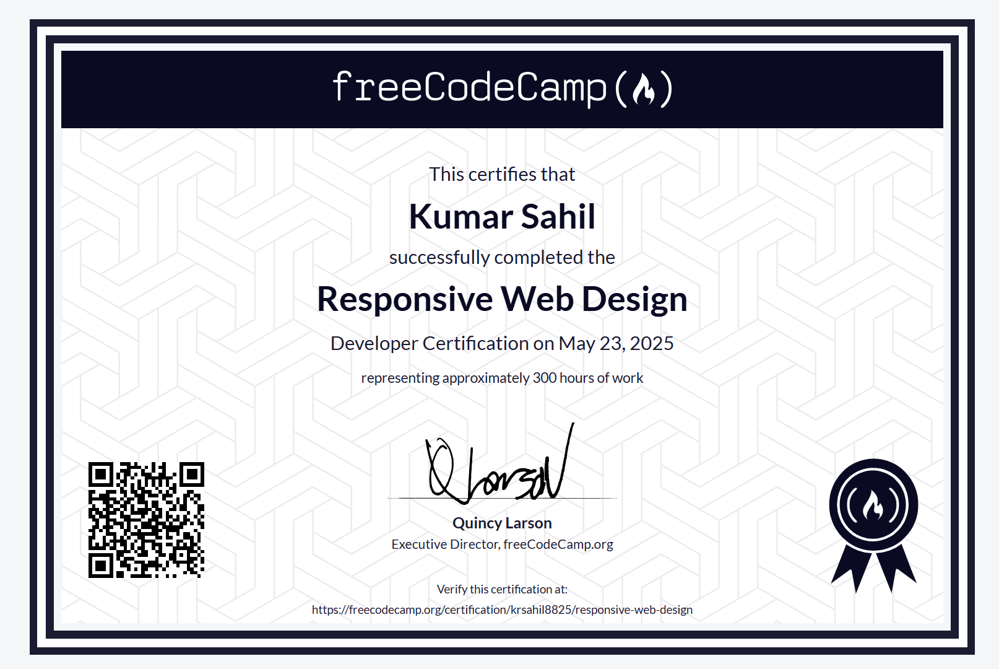

# Responsive Web Design Projects

This repository contains five responsive web design projects created as part of the [freeCodeCamp Responsive Web Design Certification](https://www.freecodecamp.org/certification/krsahil8825/responsive-web-design), completed on **May 23, 2025**.

The projects demonstrate practical knowledge of HTML and CSS, focusing on layout design, accessibility, semantic structure, and responsiveness across devices.



---

## 🌐 Live Projects

Each folder below represents an individual project built from scratch:

### 1. [Survey Form](./SurveyForm/)
A responsive and accessible survey form collecting user information. Includes form validation, semantic tags, and responsive layout.

### 2. [Tribute Page](./TributePage/)
A tribute to a notable personality. Demonstrates usage of flexbox and semantic structure with a clean layout.

### 3. [Technical Documentation Page](./TechnicalDocumentationPage/)
A documentation-style page with a fixed sidebar for navigation. Showcases multi-column layout using CSS Grid and Flexbox.

### 4. [Product Landing Page](./ProductLandingPage/)
A mock landing page for a product with sections like features, testimonials, and contact. Includes embedded media and CTA buttons.

### 5. [Personal Portfolio Webpage](./PersonalPortfolioWebpage/)
A personal portfolio to showcase your projects and contact information. Includes a responsive navbar and project cards.

---

## 🛠️ Technologies Used

- HTML5
- CSS3
- Flexbox & Grid
- Responsive Media Queries
- Semantic HTML

---

## 📂 Directory Structure

```plaintext
.
├── PersonalPortfolioWebpage/
├── ProductLandingPage/
├── SurveyForm/
├── TechnicalDocumentationPage/
├── TributePage/
├── icon.svg
├── index.html
├── styles.css
├── ResponsiveWebDesignCertification.png
└── README.md
```

## 📜 Certification

- Issued by: [FreeCodeCamp.org](https://freecodecamp.org)
- Certification: Responsive Web Design
- Hours: 300+
- Completion Date: May 23, 2025

## 🔗 License

This project is licensed under the MIT License — feel free to use and modify.

## 🙌 Acknowledgments

Thanks to freeCodeCamp for providing a comprehensive curriculum and hands-on learning platform for aspiring web developers.